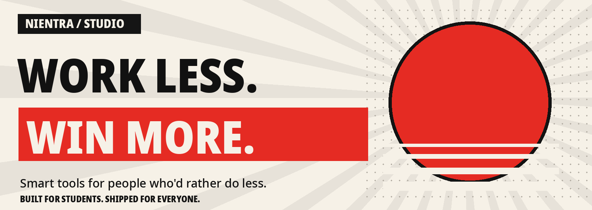

  

  <a href="https://nientra.vercel.app"><strong>Explore Nientra ↗</strong></a>
  &nbsp; · &nbsp;
  <a href="https://github.com/Nientra/Trackme/releases"><strong>Download TrackMe ↓</strong></a>
  &nbsp; · &nbsp;
  <a href="https://github.com/subasmk"><strong>Meet the founder ↗</strong></a>

## Less busywork. More progress.

Nientra is an indie software studio building tools for students and everyday life. The idea is simple: cut the effort in the boring parts, so you have more time for what matters.

Habits. Study notes. New skills. One studio, different ways to make the day easier.

## The tools

| | Product | What it does | Explore |
| :--- | :--- | :--- | :--- |
| **01** | **TrackMe** | Turn daily habits into quests. Build streaks, earn XP, and keep your sloth buddy happy. An Android app with home-screen widgets and an AI quest assistant. | [Download APK](https://github.com/Nientra/Trackme/releases) · [Source](https://github.com/Nientra/Trackme) |
| **02** | **Brainvault** | Upload your notes and ask questions. Get AI answers from your own study material. | [Explore on Nientra](https://nientra.vercel.app/#products) |
| **03** | **Skill Land** | Learn new skills one small step at a time. | [Explore on Nientra](https://nientra.vercel.app/#products) |

### Start with TrackMe

Daily quests, goals and streaks, friends, focus sessions, and a sloth that celebrates your progress. The AI assistant can draft a quest from a typed or spoken goal; you review it before saving.

**[Get TrackMe for Android →](https://github.com/Nientra/Trackme/releases)**

## What we're building toward

- **Less friction.** Make starting easier, not add another routine to manage.
- **Small wins.** Help useful habits and skills grow one step at a time.
- **Tools with personality.** Practical software doesn't have to feel lifeless.

More tools on the way.

---

  Founded by <a href="https://github.com/subasmk"><strong>Subash Mk</strong></a>. 
  <strong>WORK LESS. WIN MORE.</strong> 
  <a href="https://nientra.vercel.app">nientra.vercel.app</a>

